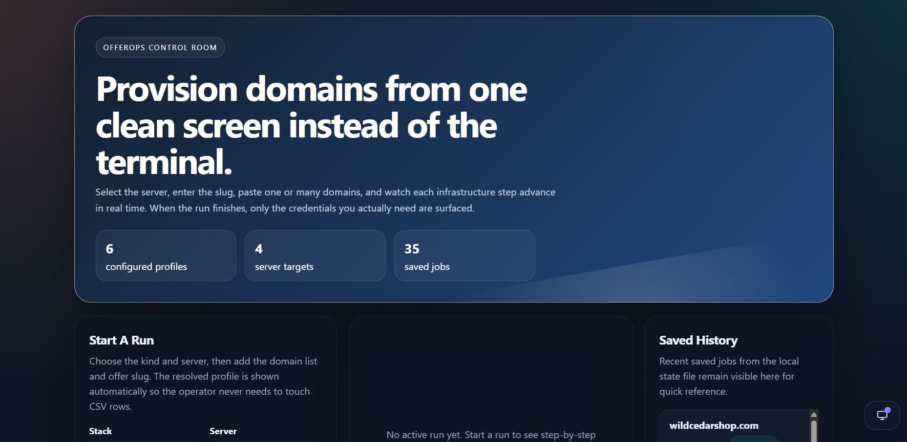
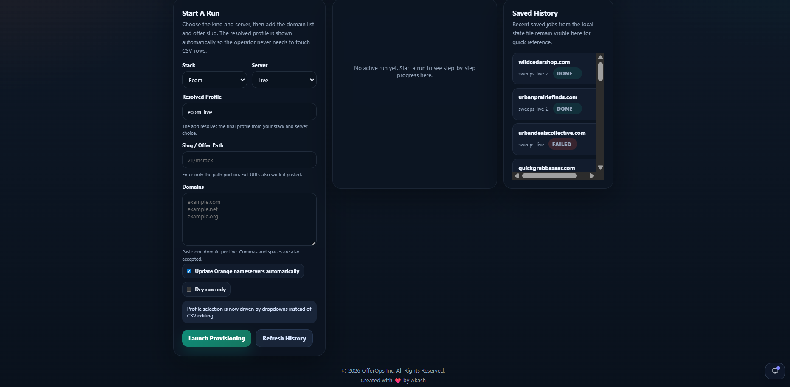

# OfferOps

> Provision domains, DNS, hosting, email, databases, and cron jobs from a single interface.

OfferOps is a Python CLI and web dashboard that automates offer-site infrastructure provisioning through Cloudflare and WHM/cPanel. Instead of manually configuring every domain, operators can deploy complete site infrastructure using reusable deployment profiles and a guided dashboard workflow.

---

## Dashboard Preview

A modern operations dashboard with Light, Dark, and System theme support for provisioning infrastructure, monitoring deployment progress, and reviewing historical runs from a single interface.

### OfferOps Control Room



### Provisioning Workflow



The dashboard enables operators to:

* Provision one or many domains at once
* Select deployment stacks and server targets
* Configure offer paths without editing CSV files
* Monitor infrastructure tasks in real time
* Review historical provisioning runs
* Surface only the credentials required after deployment

---

## Why OfferOps?

Provisioning offer infrastructure often requires repetitive work across multiple systems:

* Cloudflare
* WHM/cPanel
* Domain registrars
* DNS management
* Email configuration
* Database creation
* Cron scheduling

OfferOps standardizes the entire process into a repeatable workflow that reduces manual effort and deployment mistakes.

---

## Features

### Cloudflare Automation

* Create or reuse Cloudflare zones
* Publish SPF, DKIM, and DMARC records
* Enable Bot Fight Mode
* Manage DNS records from predefined templates

### Hosting Automation

* Create or reuse cPanel accounts
* Create support mailboxes
* Upload starter application files
* Configure document roots

### Database Provisioning

* Create MySQL databases
* Create database users
* Assign permissions automatically

### Registrar Integration

* Update nameservers automatically through Orange browser automation
* Support manual registrar workflows when automation is disabled

### Operations Dashboard

* Launch deployments without editing CSV files
* Live provisioning status updates
* Historical run tracking
* Local state persistence for auditing and retries

---

## What Happens During Provisioning?

For every domain submitted, OfferOps can:

1. Create or reuse the Cloudflare zone
2. Configure nameservers
3. Create or reuse the cPanel account
4. Create the support mailbox
5. Publish deliverability records
6. Upload starter files
7. Create the database and user
8. Register cron jobs
9. Save deployment state and results

---

## Quick Start

### Clone the Repository

```powershell
git clone <repository-url>
cd offerops
```

### Create a Virtual Environment

```powershell
py -m venv .venv
.\.venv\Scripts\Activate.ps1
```

### Install Dependencies

```powershell
pip install -e .
```

---

## Configuration

Create your local environment file:

```powershell
Copy-Item .env.example .env
```

Create your local configuration file:

```powershell
Copy-Item config.example.json config.json
```

Update the following values:

* Cloudflare credentials
* WHM credentials
* Orange registrar credentials
* Server mappings
* DNS templates
* Cron templates
* Deployment profiles

> Never commit `.env` or `config.json` files containing real credentials.

---

## Running the Dashboard

Start the web interface:

```powershell
python -m offerops.cli web --port 8787
```

Open:

```text
http://127.0.0.1:8787
```

---

## Running a Dry Run

Validate provisioning without making changes:

```powershell
python -m offerops.cli run --csv data/domains.csv --dry-run
```

---

## Running Provisioning

Execute a deployment:

```powershell
python -m offerops.cli run --csv data/domains.csv
```

---

## Orange Nameserver Automation

Run provisioning with automatic registrar updates:

```powershell
python -m offerops.cli run --csv data/domains.csv --orange-browser
```

Test only the registrar automation:

```powershell
python -m offerops.cli orange-ns --domain example.com --profile sweeps-live
```

---

## CSV Import Format

```csv
domain,profile,offer_path,notes
harborcartmarket.test,ecom-live,https://www.harborcartmarket.test/v1/msrack,
brightbuyexchange.test,sweeps-live,https://www.brightbuyexchange.test/v1/msrack,
```

### Fields

| Field      | Description         |
| ---------- | ------------------- |
| domain     | Domain to provision |
| profile    | Deployment profile  |
| offer_path | Offer URL or path   |
| notes      | Optional metadata   |

---

## Profiles

OfferOps supports multiple deployment profiles.

Example profile types:

* ecom-live
* ecom-bkp
* sweeps-live
* sweeps-bkp
* sweeps-live-2
* sweeps-bkp-2

Profiles determine:

* Cloudflare account
* WHM target
* DNS templates
* Cron templates
* Hosting configuration

---

## Environment Variables

### Cloudflare

```text
CLOUDFLARE_SWEEPS_API_TOKEN
CLOUDFLARE_SWEEPS_ACCOUNT_ID
CLOUDFLARE_ECOM_API_TOKEN
CLOUDFLARE_ECOM_ACCOUNT_ID
```

### WHM

```text
WHM_URL
WHM_USERNAME
WHM_API_TOKEN
```

### Orange

```text
ORANGE_LOGIN_URL
ORANGE_HEADLESS
ORANGE_USERNAME
ORANGE_PASSWORD
```

---

## Security

OfferOps is designed so sensitive information remains outside source control.

Ignored by Git:

```text
.env
.env.*
config.json
logs/
state/
.tmp/
dist/
build/
*.egg-info/
```

Before pushing:

* Verify no credentials are staged
* Verify runtime state is excluded
* Use least-privilege API tokens
* Rotate exposed credentials immediately

---

## Running Tests

```powershell
python -m unittest discover -s tests -p "test_*.py"
```

---

## License

Internal tooling project. Use according to your organization's policies.

---

Built with Python, Cloudflare, WHM/cPanel, Selenium, and a lot less repetitive clicking.
